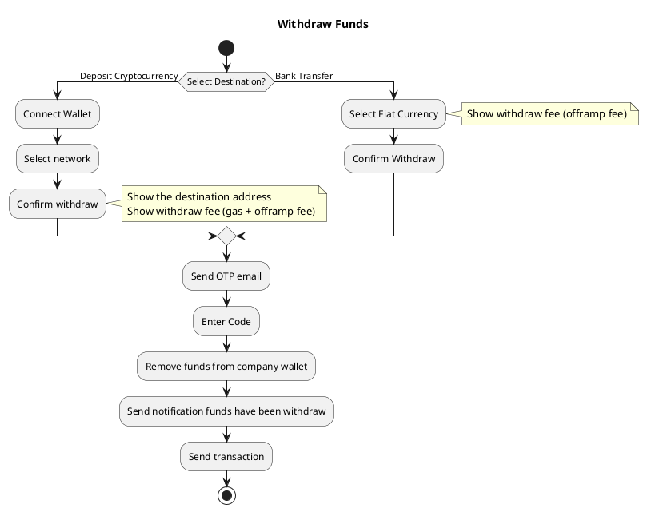
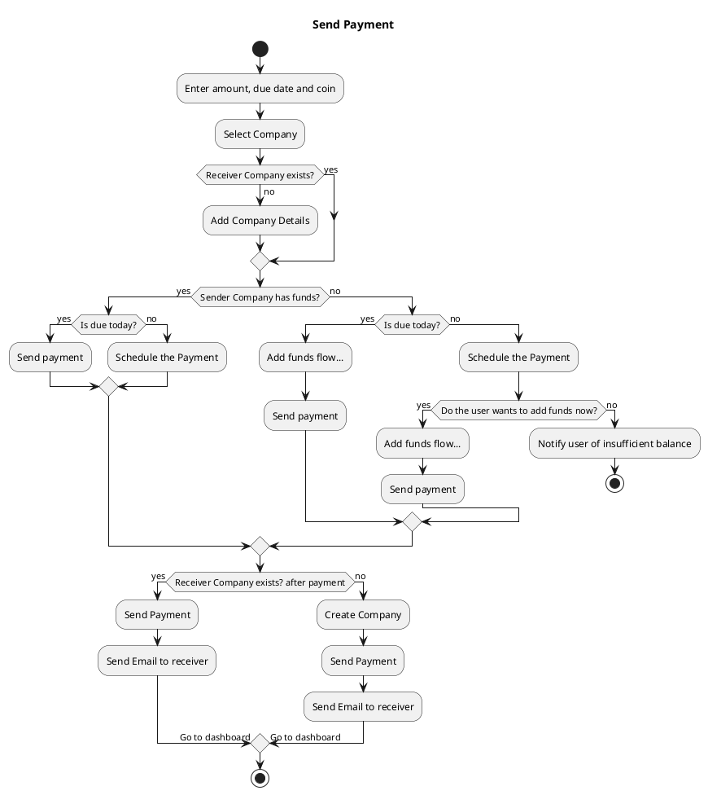
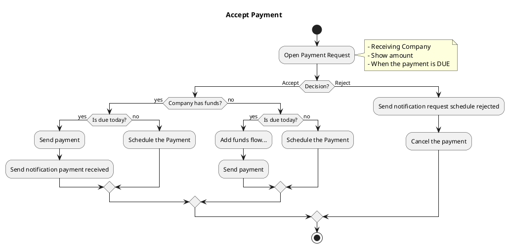
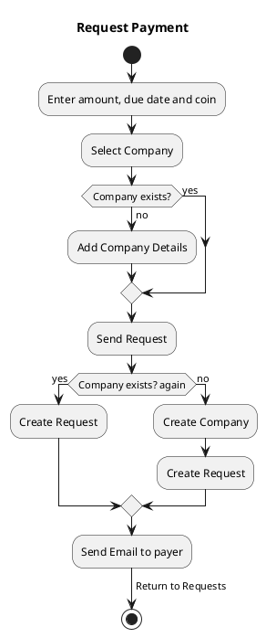
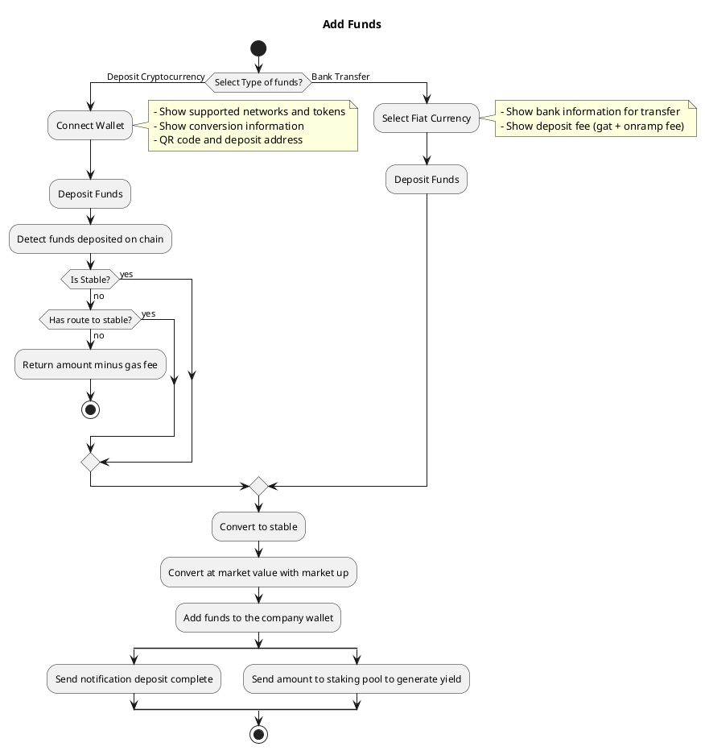

# Vero Finance Platform

Welcome to your next-generation financial management application. This project is a comprehensive full-stack solution designed to handle payments, fund transfers, and financial requests with a modern, offline-first architecture.

## Tech Stack

This application is built using a simple yet powerful technology stack focused on performance, developer experience, and offline capability:

* **Framework**: **Next.js** is used for its hybrid static and server rendering, file-based routing (App Router), and overall robust React development experience.
* **Client-Side "Backend"**: **IndexedDB** serves as the application's database, operating entirely within the user's browser. This approach allows all data to be stored locally, providing a fast, secure, and offline-capable experience without the need for a traditional server-side database.

## Core Features & Workflows

The application's functionality is broken down into five core workflows, each visualized below using PlantUML.

### 1. Withdraw Funds

This workflow manages how users can withdraw funds from their account, supporting both cryptocurrency and traditional bank transfers. It includes security steps like OTP verification.

### 2. Send Payment

This workflow details the process of a user sending a payment. It includes checks for company existence, available funds, and scheduling options.

### 3. Accept Payment

This workflow outlines how a user can respond to a payment request, with options to accept or reject it.

### 4. Request Payment

This workflow allows users to create and send a payment request to another entity.

### 5. Add Funds

This workflow covers the two methods for users to add funds to their account: cryptocurrency deposits and bank transfers.

## Getting Started

To get this project running on your local machine, you will need to have Node.js and a package manager (like npm or yarn) installed.

### Installation

First, clone the repository from your source control provider. Once cloned, navigate into the project directory and install the necessary dependencies using your preferred package manager. After the installation is complete, you can start the development server. The application will then be accessible in your web browser, typically at `http://localhost:3000`.
